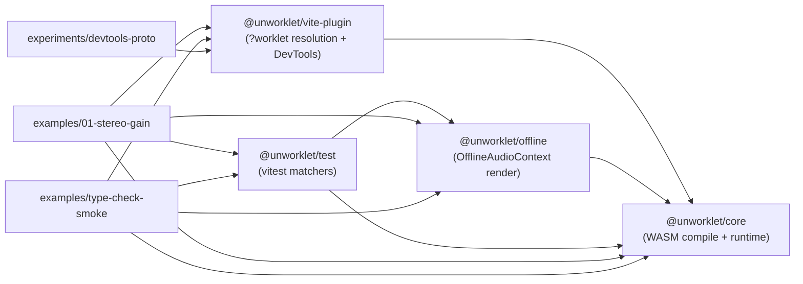

# unworklet

TypeScript-first framework for declarative Audio Worklet DSP, compiled to WebAssembly. v1.0.0 implementation in progress (see `docs/10-roadmap.md`).

## Monorepo layout



`core` も devDep として `vite-plugin` に依存している (= browser e2e の test config で `?worklet` resolution を使う)。 build 順序は cycle になるので CI は `vp run --filter @unworklet/vite-plugin build && vp run --filter @unworklet/core build && ...` の chain で解決。

### packages/ (公開 npm)

| package                  | 役割                                                                                |
| ------------------------ | ----------------------------------------------------------------------------------- |
| `@unworklet/core`        | DSL surface + capture/analyze/emit pipeline + worklet runtime + main thread surface |
| `@unworklet/vite-plugin` | Vite plugin = `?worklet` import → CompiledProcessor、 DevTools panel host           |
| `@unworklet/offline`     | `renderOffline` = OfflineAudioContext で blocking render                            |
| `@unworklet/test`        | vitest matcher 拡張 (= `expectStateMatches`, `expectEventsContaining` 等)           |

### examples/ (内部 demo、 npm 非公開)

| package                                | 役割                                                                  |
| -------------------------------------- | --------------------------------------------------------------------- |
| `@unworklet-examples/01-stereo-gain`   | canonical Ex 1 full = stereo gain + meter L/R subscribe + diagnostics |
| `@unworklet-examples/type-check-smoke` | 公開 surface の TS 型を end-to-end で typecheck する smoke            |

### experiments/ (scratch、 npm 非公開)

| package          | 役割                                                |
| ---------------- | --------------------------------------------------- |
| `devtools-proto` | DevTools UI prototype (= Vue で mock data 駆動表示) |

## Setup

```bash
vp install     # 依存 install
vp config      # pre-commit hook を local 設定 (= staged file に vp check --fix 自動)
```

## Development

| Action                                         | Command                                              |
| ---------------------------------------------- | ---------------------------------------------------- |
| 全 lint + format + typecheck                   | `vp check` (= auto-fix `vp check --fix`)             |
| 全 test (= vitest 集約 + playwright e2e chain) | `vp run test`                                        |
| Vitest 集約のみ (= node-side + browser e2e)    | `vp test`                                            |
| Playwright e2e のみ                            | `vp run --filter ./examples/01-stereo-gain test:e2e` |
| 全 build (= 下記 chain、 cycle 回避)           | (下のコードブロック)                                 |
| Examples dev server                            | `vp run --filter ./examples/01-stereo-gain dev`      |
| 全 check + test + build (= ship 直前 sanity)   | `vp run ready`                                       |

全 build chain (= `vp run -r build` は core / vite-plugin の cycle で fail するので、 順序を明示):

```bash
vp run --filter @unworklet/vite-plugin build && \
vp run --filter @unworklet/core build && \
vp run --filter @unworklet/offline build && \
vp run --filter @unworklet/test build
```

詳細な実装規約 + AI agent 向け guidance は [`AGENTS.md`](./AGENTS.md) を参照。
