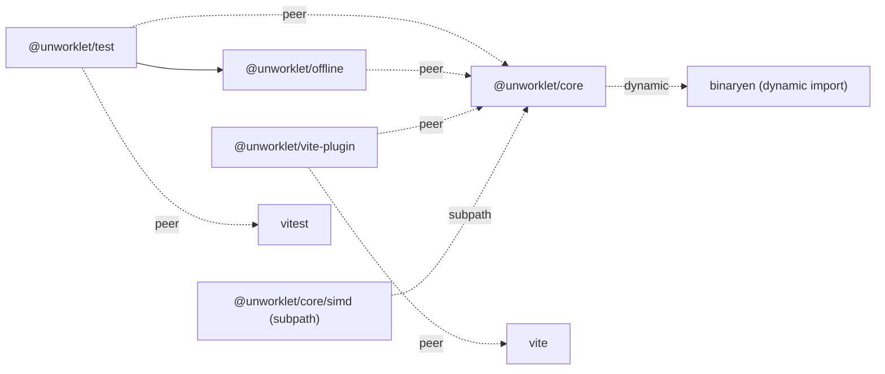

# 09 — Repository structure

How the source code itself is organized: monorepo tooling, package boundaries, license, npm scope, language-toolchain version policy.

This doc is independent of the component docs and can be picked up at any time.

## Status

partial (§1–§5 settled at Q60 / Q61; §6 placeholder per Q61 = fill deferred to impl-phase)

## 1. Monorepo tool

pnpm workspaces。 root に `pnpm-workspace.yaml`、 root `package.json` の `packageManager` field で `pnpm@<version>` を 明 示、 cross-package reference は `workspace:*` protocol。 開 発 / CI で の 起 動 は 全 て `vp` CLI 経 由 で 統 一 (= AGENTS.md HARD CONTRACT、 npm / pnpm / yarn / npx 直 接 起 動 永 久 排 除)。 Q60 (`decisions-log.md`)。

## 2. Package layout

Day-one か ら 公 開 4 package + 内 部 module を 立 て る:

- 公 開: `@unworklet/core` / `@unworklet/vite-plugin` / `@unworklet/offline` / `@unworklet/test`
- 公 開 subpath: `@unworklet/core/simd`
- 内 部 module: worklet runtime (= `@unworklet/core` 内、 公 開 package で は な い)。 compiler module 自 体 は `@unworklet/core` 内 部 module だ が、 compile invocation 経 路 は `@unworklet/core` か ら 公 開 さ れ る `compile` 関 数 と し て expose (= vite-plugin / offline / `replaceProcessor` / 直 接 import す る consumer 全 て が 同 一 関 数 を call、 §2.1 + §2.4 参 照)。

権 威 規 定 = `decisions-log.md` Q13 + Q52。

### 2.1 `@unworklet/core` named exports (categorized list)

`@unworklet/core` root か ら flat export す る v1.0.0 公 開 識 別 子 を category 別 に 整 理 (Q52 strict — DSL 識 別 子 は root に flat、 subpath split し な い)。 SIMD primitive は `@unworklet/core/simd` subpath か ら、 test matcher は `@unworklet/test` か ら、 offline runner は `@unworklet/offline` か ら 別 export。

| Category | Exports |
|---|---|
| Processor / subgraph constructors | `defineProcessor`, `defineSubgraph`, `createSubgraph`, `replaceProcessor` (Q50) |
| Compile invocation | `compile(processor)` async 関 数 (= 戻 り 値 `{ wasm, graph, memory, diagnostics, schemaHash }` 一 括) — vite-plugin / offline / `replaceProcessor` / 直 接 import す る consumer (= visual programming editor / modular synth web app / on-the-fly source 評 価 等 動 的 path 含 む) 全 て が 同 一 関 数 を call (§2.4 invariant、 binaryen は こ の 関 数 内 部 で dynamic import、 TS generic constraint 細 部 は impl-phase fill) |
| Main-side surface | `createNode`, `inspect` (Q48 — free function over blob) |
| Declarations | `state.f32` / `state.f64` / `state.i32` / `state.i64` / `state.bool`, `buffer.f32` / `buffer.f64` / `buffer.i32` / `buffer.i64` / `buffer.bool` / `buffer.u8` (Q49), `param`, `audioInput`, `audioOutput`, `event`, `message`, `midiInput`, `midiOutput` |
| DSL primitive — arithmetic / comparison / math / control | `add`, `sub`, `mul`, `div`, `mod`, `neg`, `eq`, `lt`, `gt`, `lte`, `gte`, `sin`, `cos`, `tan`, `tanh`, `exp`, `log`, `sqrt`, `abs`, `floor`, `ceil`, `frac`, `min`, `max`, `clamp`, `select` |
| DSL primitive — scalar constructors (Q33 + Q77) | `f32`, `f64`, `i32`, `i64`, `bool`, `num` (= chain-start helper) |
| Loop primitive | `forSample` (= callable with `.byN` property — Q43 callback delivers `everyNSamples` as second arg) |
| Build-time constants | `SAMPLES_PER_BLOCK` (Q35), `CAPACITY_16` / `CAPACITY_32` / `CAPACITY_64` / `CAPACITY_128` / `CAPACITY_256` / `CAPACITY_512` / `CAPACITY_1024` / `CAPACITY_2048` / `CAPACITY_4096` / `CAPACITY_8192` / `CAPACITY_16384` (Q44) |
| Public types | `Node<T>`, `State<T>`, `Buffer<T>`, `Param`, `AudioInputHandle<C>`, `AudioOutputHandle<C>`, `EventDecl<T>`, `MessageDecl<T>`, `MidiInputHandle`, `MidiOutputHandle`, `CompiledProcessor<C>` (= carries `.worklet` function namespace for the escape-hatch path, Q80), `UnworkletNode<C>`, `RestoreResult`, `ReplaceResult<New>`, `InspectionResult`, `Migration`, `MigrationHelpers`, `MidiEvent`, `MidiEventGraph`, `Capacity` |

### 2.2 `@unworklet/core/simd` named exports

Opt-in SIMD surface (Q3-a — scalar-only authors never import this path).

| Category | Exports |
|---|---|
| Construction | `vec4`, `splat` |
| Arithmetic | `addVec`, `subVec`, `mulVec`, `divVec` |
| Horizontal reduction | `sumLanes` (Q59) |
| Vector types | `Node<'f32x4'>` (= the `'f32x4'` tag becomes part of the `Node<T>` type union for modules that import this path) |

Lane access (`vec.lane(i)`) is a method on the `Node<'f32x4'>` value; `buf.loadVec(offset)` / `buf.storeVec(offset, value)` are methods on `Buffer<'f32'>` handles. Both are typed via this subpath but accessed via member syntax (= not standalone named exports).

### 2.3 Other public packages

- `@unworklet/vite-plugin` — exports the Vite plugin factory + DevTools panel + analysis JSON artifact contract (`07-vite-plugin.md`)。 build pipeline 内 で `@unworklet/core` の `compile` 関 数 を call し て WASM を emit。
- `@unworklet/offline` — exports `renderOffline` (`13-offline-render.md` §2)。 内 部 で `@unworklet/core` の `compile` 関 数 を call し て WASM 化、 host JS の `WebAssembly.instantiate` で offline 実 行。
- `@unworklet/test` — exports vitest matchers (`expectAudioMatches`, `expectNoNaN`, `expectPeakUnder`, `expectRmsUnder`, `expectEventsEqual`, `expectStateMatches`, etc. — `06-testing.md` §2; depends on `@unworklet/offline`).

Per-identifier signature detail / generic constraint is impl-phase fill per Q53 + Q61.

### 2.4 Package dependency graph

公 開 4 package + 1 subpath + external dep の `package.json` dependency 関 係 を visual graph + table の 2 view で declare (= acceptance F1 で 公 開 surface check 対 象):

凡 例: 実 線 矢 印 = `dependencies` (= install で 自 動 解 決、 consumer の bundle に 入 る) — 例: `test --> offline`。 破 線 矢 印 + ラベル = relation 種 別 — `peer` (= `peerDependencies`、 consumer 側 で 揃 え る) / `dynamic` (= 内 部 dynamic import、 `compile` call 時 の み load、 production runtime bundle に 含 ま れ な い) / `subpath` (= 同 package 内 の sub-export path、 別 install ナ シ)。

| Package | `dependencies` | `peerDependencies` | 意 図 |
|---|---|---|---|
| `@unworklet/core` | `binaryen` (= dynamic import、 `compile` call 時 のみ load、 production runtime bundle に 含 ま れ な い) | (= ナ シ) | `compile` 関 数 内 で binaryen を dynamic import し て WASM emit、 production runtime で 静 的 path だ け を 使 う 経 路 (= 既 emit 済 WASM を load + 駆 動 す る だ け) で は binaryen は load さ れ ず bundle に も 含 ま れ な い。 invariant = `@unworklet/core` を import し て も `compile` を call し な い consumer (= deploy 後 の end-user app 等) は binaryen に 触 ら な い (= dynamic import で 構 造 的 担 保)。 動 的 path (= visual programming editor / live coding 等 で `compile` を runtime に call す る app) は 起 点 か ら の dynamic import 解 析 経 由 で binaryen chunk が bundle に 載 る = trade-off を user が 引 き 受 け る。 |
| `@unworklet/vite-plugin` | (= ナ シ) | `@unworklet/core` + `vite` | user が install 済 の core / vite に 寄 生、 version drift を 避 け る。 |
| `@unworklet/offline` | (= 内 部 で host JS の WebAssembly runtime で WASM binary を instantiate し て 実 行 = Node.js / Bun / Deno 等 の `WebAssembly.instantiate` を 使 う) | `@unworklet/core` | core と 同 major version で 動 か す 制 約、 WASM execution layer 自 体 は 内 部 module。 |
| `@unworklet/test` | `@unworklet/offline` | `@unworklet/core` + `vitest` | matcher が offline を 必 ず 使 う = auto-resolve、 user install 数 削 減 (= 1 install で 動 く)。 |

invariant: `@unworklet/core` の major version が 上 が る と 全 satellite package も 同 major で release (= peer 経 由 で version 強 制)。 acceptance F1 の 公 開 surface check は `package.json` の `dependencies` / `peerDependencies` field set が こ の 表 と 一 致 す る こ と を 検 証 (= binaryen は `@unworklet/core` の `dependencies` に declare、 ただし dynamic import 経 由 で 静 的 path consumer の production runtime bundle か ら 除 外 さ れ る 構 造 を 担 保)。

## 3. License

MIT。 Q60 (`decisions-log.md`)。

## 4. npm scope

`@unworklet`。 Q60 (`decisions-log.md`)。

## 5. TypeScript version policy

TypeScript 5.5 minimum。 Q60 (`decisions-log.md`)。

## 6. Versioning policy

<!-- semver shape, breaking-change rules, recompilation requirement on major bumps.
     Fill deferred to impl-phase owner per Q61 (Q14 itself resolved at Q62). -->
