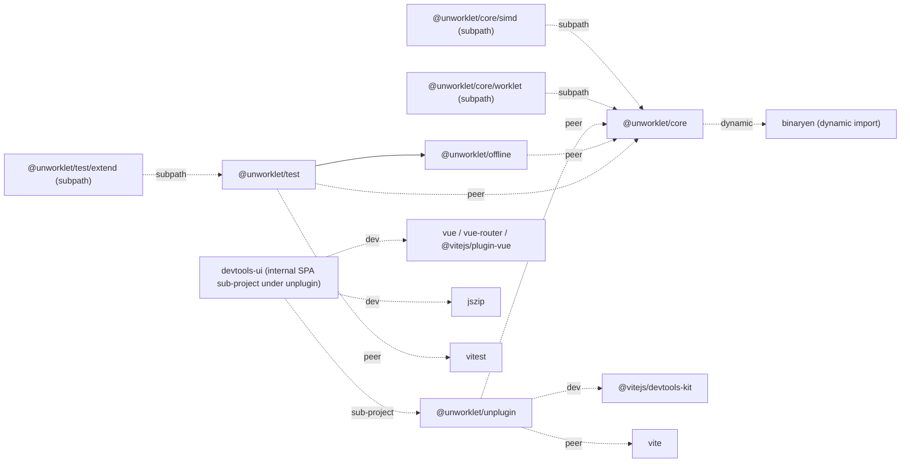

# 09 — Repository structure

How the source code itself is organized: monorepo tooling, package boundaries, license, npm scope, language-toolchain version policy.

This doc is independent of the component docs and can be picked up at any time.

## Status

partial (§1–§5 settled at Q60 / Q61; §6 placeholder per Q61 = fill deferred to impl-phase)

## 1. Monorepo tool

pnpm workspaces. A `pnpm-workspace.yaml` lives at the root, the root `package.json` pins the package manager via the `packageManager` field as `pnpm@<version>`, and cross-package references use the `workspace:*` protocol. All dev and CI invocations go through the `vp` CLI exclusively (= AGENTS.md HARD CONTRACT; direct invocation of npm / pnpm / yarn / npx is permanently banned). Q60 (`decisions-log.md`).

## 2. Package layout

Four public packages plus internal modules are established from day one:

- Public: `@unworklet/core` / `@unworklet/unplugin` / `@unworklet/offline` / `@unworklet/test`
- Public subpaths: `@unworklet/core/simd` / `@unworklet/core/worklet` / `@unworklet/test/extend`.
  - `@unworklet/core/simd` = opt-in SIMD primitive set (§2.2).
  - `@unworklet/core/worklet` = the runtime helper (`makeWorkletNamespaceFromMeta(meta)`, §2.3) that the worklet entry template emitted by the unplugin boots inside `AudioWorkletGlobalScope`. Users do not import this subpath directly; instead, the template emitted via the `?worklet` route references this subpath, and the consumer's bundler resolves it — making it a semi-public surface that is explicitly exposed via `exports`.
  - `@unworklet/test/extend` = side-effect import path for registering matchers via the chain form `expect.extend(...)` (`06-testing.md` §6).
- Internal modules: the compiler module lives inside `@unworklet/core` as an internal module, but the compile invocation path is exposed as the `compile` function exported from `@unworklet/core` (= all callers — unplugin / offline / `replaceProcessor` / consumers that import directly — call the same function, §2.1 + §2.4).

Authoritative definition: `decisions-log.md` Q13 + Q52.

### 2.1 `@unworklet/core` named exports (categorized list)

All v1.0.0 public identifiers exported flat from the `@unworklet/core` root, organized by category (Q52 strict — DSL identifiers are flat at root, no subpath split). SIMD primitives are exported from the `@unworklet/core/simd` subpath; test matchers / signal utilities / MIDI utilities / sample-time utilities / chain form come from `@unworklet/test` (plus the side-effect subpath `@unworklet/test/extend`); the offline runner comes from `@unworklet/offline`.

| Category                                                 | Exports                                                                                                                                                                                                                                                                                                                                                                                                                                                                                       |
| -------------------------------------------------------- | --------------------------------------------------------------------------------------------------------------------------------------------------------------------------------------------------------------------------------------------------------------------------------------------------------------------------------------------------------------------------------------------------------------------------------------------------------------------------------------------- |
| Processor / subgraph constructors                        | `defineProcessor`, `defineSubgraph`, `instantiate`, `replaceProcessor` (Q50)                                                                                                                                                                                                                                                                                                                                                                                                                  |
| Compile invocation                                       | `compile(processor)` async function (= returns `{ wasm, graph, memory, diagnostics, schemaHash }` as a single object) — used by unplugin / offline / `replaceProcessor` / consumers that import directly (including dynamic paths such as visual programming editors, modular synth web apps, and on-the-fly source evaluation); all callers use the same function (§2.4 invariant; binaryen is dynamically imported inside this function; TS generic constraint details are impl-phase fill) |
| Main-side surface                                        | `createNode`, `inspect` (Q48 — free function over blob)                                                                                                                                                                                                                                                                                                                                                                                                                                       |
| Declarations                                             | `state.f32` / `state.f64` / `state.i32` / `state.i64` / `state.bool`, `state.buffer.f32` / `state.buffer.f64` / `state.buffer.i32` / `state.buffer.i64` / `state.buffer.bool` / `state.buffer.u8` (Q49), `param`, `audioInput`, `audioOutput`, `event` (`event<T>({ from \| to: "main" })` + `event.midi`)                                                                                                                                                                                    |
| DSL primitive — arithmetic / comparison / math / control | `add`, `sub`, `mul`, `div`, `mod`, `neg`, `eq`, `lt`, `gt`, `lte`, `gte`, `sin`, `cos`, `tan`, `tanh`, `exp`, `log`, `sqrt`, `abs`, `floor`, `ceil`, `frac`, `min`, `max`, `clamp`, `select`                                                                                                                                                                                                                                                                                                  |
| DSL primitive — scalar constructors (Q33)                | `f32`, `f64`, `i32`, `i64`, `bool`                                                                                                                                                                                                                                                                                                                                                                                                                                                            |
| Loop primitive                                           | `forSample` (= callable with `.byN` property — Q43 callback delivers `everyNSamples` as second arg)                                                                                                                                                                                                                                                                                                                                                                                           |
| Build-time constants                                     | `SAMPLES_PER_BLOCK` (Q35), `CAPACITY_16` / `CAPACITY_32` / `CAPACITY_64` / `CAPACITY_128` / `CAPACITY_256` / `CAPACITY_512` / `CAPACITY_1024` / `CAPACITY_2048` / `CAPACITY_4096` / `CAPACITY_8192` / `CAPACITY_16384` (Q44)                                                                                                                                                                                                                                                                  |
| Public types                                             | `Node<T>`, `State<T>`, `Buffer<T>`, `Param`, `AudioInputHandle<C>`, `AudioOutputHandle<C>`, `EventDecl<T>`, `MessageDecl<T>`, `MidiInputHandle`, `MidiOutputHandle`, `CompiledProcessor<C>` (= carries `.worklet` function namespace for the escape-hatch path, Q80), `UnworkletNode<C>`, `RestoreResult`, `ReplaceResult<New>`, `InspectionResult`, `Migration`, `MigrationHelpers`, `MidiEvent`, `MidiEventGraph`, `Capacity`                                                               |

### 2.2 `@unworklet/core/simd` named exports

Opt-in SIMD surface (Q3-a — scalar-only authors never import this path).

| Category             | Exports                                                                                                          |
| -------------------- | ---------------------------------------------------------------------------------------------------------------- |
| Construction         | `vec4`, `splat`                                                                                                  |
| Arithmetic           | `addVec`, `subVec`, `mulVec`, `divVec`                                                                           |
| Horizontal reduction | `sumLanes` (Q59)                                                                                                 |
| Vector types         | `Node<'f32x4'>` (= the `'f32x4'` tag becomes part of the `Node<T>` type union for modules that import this path) |

Lane access (`vec.lane(i)`) is a method on the `Node<'f32x4'>` value; `buf.loadVec(offset)` / `buf.storeVec(offset, value)` are methods on `Buffer<'f32'>` handles. Both are typed via this subpath but accessed via member syntax (= not standalone named exports).

### 2.3 `@unworklet/core/worklet` named exports

The runtime helper that the worklet entry template emitted by the unplugin runs inside `AudioWorkletGlobalScope`. Users do not import this directly (entry into the main bundle goes through the `@unworklet/core` root); instead, the `import { makeWorkletNamespaceFromMeta } from "@unworklet/core/worklet"` statement in the template is resolved by the bundler, making this a semi-public surface. Only the subset of the surface that is safe to load in the worklet realm is included here; `binaryen`, `defineProcessor`, graph capture machinery, and similar are entirely excluded (= prevents unsafe or unnecessary dependencies from entering the worklet realm).

| Category     | Exports                                                 |
| ------------ | ------------------------------------------------------- |
| Bootstrap    | `makeWorkletNamespaceFromMeta(meta) → WorkletNamespace` |
| Public types | `WorkletMeta`, `WorkletNamespace`                       |

### 2.4 Other public packages

- `@unworklet/unplugin` — exports the Vite plugin factory + DevTools panel + analysis JSON artifact contract (`07-unplugin.md`). Calls `@unworklet/core`'s `compile` function inside the build pipeline to emit WASM.
- `@unworklet/offline` — exports `renderOffline` (`13-offline-render.md` §2). Calls `@unworklet/core`'s `compile` function internally to produce WASM, then executes it offline via the host JS `WebAssembly.instantiate`.
- `@unworklet/test` — exports vitest matchers + audio test utilities (all 43 items plus chain form, covering `06-testing.md` §2–§6). Breakdown: 20 matchers (audio / sample-level / event / MIDI / state, `06-testing.md` §2), 7 signal construction utilities (`sine` / `silence` / `impulse` / `sineSweep` / `whiteNoise` / `dc` / `ramp`, §3), 10 MIDI utilities (9 variants in the `midi` namespace + `sequence`, §4), 6 sample/time conversion utilities (`samplesToMs` / `msToSamples` / `samplesToSec` / `secToSamples` / `bpmToSamples` / `bpmToMs`, §5), chain form (= `@unworklet/test/extend` side-effect import, §6). Depends on `@unworklet/offline`.

Per-identifier signature detail / generic constraint is impl-phase fill per Q53 + Q61.

### 2.5 Package dependency graph

The `package.json` dependency relationships among the 4 public packages, 2 subpaths, and external deps, declared in both a visual graph and a table (= subject to acceptance F1 public surface check):

Legend: solid arrow = `dependencies` (resolved automatically on install; included in the consumer's bundle) — e.g. `test --> offline`. Dashed arrow + label = relationship type — `peer` (= `peerDependencies`, must be provided by the consumer) / `dynamic` (= internal dynamic import, loaded only when `compile` is called, excluded from the production runtime bundle) / `subpath` (= sub-export path within the same package, no separate install needed) / `dev` (= `devDependencies`, used only during development, not included in the consumer's production bundle) / `sub-project` (= a nested sub-project inside the package, no separate install needed; bundled into `dist/` by the parent package's build).

The DevTools panel UI of `@unworklet/unplugin` is a Vue 3 SPA sub-project located at `packages/unplugin/devtools-ui/`. The parent package's `vp run build` (an orchestration script that chains `vp build` + `vp pack`) copies the compiled SPA into `<unplugin>/dist/ui/` and ships it as a single bundle. The SPA itself is never exposed to the consumer's production runtime; it is loaded as an iframe panel only in dev mode (= `vp dev`).

| Package               | `dependencies`                                                                                                                          | `peerDependencies`           | Intent                                                                                                                                                                                                                                                                                                                                                                                                                                                                                                                                                                                                                                                                           |
| --------------------- | --------------------------------------------------------------------------------------------------------------------------------------- | ---------------------------- | -------------------------------------------------------------------------------------------------------------------------------------------------------------------------------------------------------------------------------------------------------------------------------------------------------------------------------------------------------------------------------------------------------------------------------------------------------------------------------------------------------------------------------------------------------------------------------------------------------------------------------------------------------------------------------- |
| `@unworklet/core`     | `binaryen` (= dynamic import; loaded only when `compile` is called; not included in the production runtime bundle)                      | (= none)                     | binaryen is dynamically imported inside the `compile` function to emit WASM. Consumers that only use the static path (= load and drive an already-emitted WASM without calling `compile`) never load binaryen and it is not included in their bundle. Invariant: consumers of `@unworklet/core` that never call `compile` (e.g. end-user apps after deploy) never touch binaryen — this is structurally guaranteed by the dynamic import. Consumers on the dynamic path (e.g. visual programming editors or live coding apps that call `compile` at runtime) will have the binaryen chunk included in their bundle via dynamic import analysis — a trade-off those users accept. |
| `@unworklet/unplugin` | (= none)                                                                                                                                | `@unworklet/core` + `vite`   | Piggybacks on the core and vite already installed by the user, avoiding version drift.                                                                                                                                                                                                                                                                                                                                                                                                                                                                                                                                                                                           |
| `@unworklet/offline`  | (= instantiates and runs WASM binaries internally via the host JS WebAssembly runtime — Node.js / Bun / Deno `WebAssembly.instantiate`) | `@unworklet/core`            | Must run with the same major version as core; the WASM execution layer itself is an internal module.                                                                                                                                                                                                                                                                                                                                                                                                                                                                                                                                                                             |
| `@unworklet/test`     | `@unworklet/offline`                                                                                                                    | `@unworklet/core` + `vitest` | Matchers always use offline, so it auto-resolves; reduces the number of installs the user needs (= works with a single install).                                                                                                                                                                                                                                                                                                                                                                                                                                                                                                                                                 |

Invariant: when `@unworklet/core` bumps a major version, all satellite packages release under the same major (enforced via peer dependencies). The acceptance F1 public surface check verifies that the `dependencies` / `peerDependencies` field sets in each `package.json` match this table (= binaryen is declared in `@unworklet/core`'s `dependencies`, but its dynamic import path structurally guarantees exclusion from the production runtime bundle of consumers on the static path).

## 3. License

MIT. Q60 (`decisions-log.md`).

## 4. npm scope

`@unworklet`. Q60 (`decisions-log.md`).

## 5. TypeScript version policy

TypeScript 5.5 minimum. Q60 (`decisions-log.md`).

## 6. Versioning policy

<!-- semver shape, breaking-change rules, recompilation requirement on major bumps.
     Fill deferred to impl-phase owner per Q61 (Q14 itself resolved at Q62). -->
